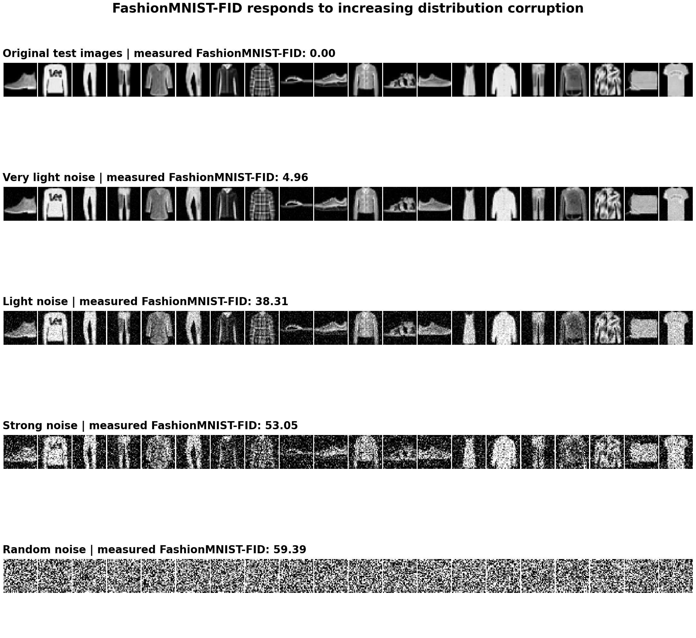

# FashionMNIST-FID

A reproducible, domain-specific Frechet distance for FashionMNIST generators.
It uses the fixed classifier's 128-dimensional pre-logits features and is not
standard Inception-FID.

The full metric contract is documented in
[`FashionMNIST-FID 评估方案.md`](FashionMNIST-FID%20评估方案.md).

## Measured sanity check



This comparison uses all 10,000 FashionMNIST test images and the same
classifier-specific real statistics for every row. With random seed 2026, the
measured scores are:

| Distribution | FashionMNIST-FID |
| --- | ---: |
| Original test10k | 0.00 |
| Test10k + very light Gaussian noise (`sigma=0.023`) | 4.96 |
| Test10k + light Gaussian noise (`sigma=0.10`) | 38.31 |
| Test10k + strong Gaussian noise (`sigma=0.30`) | 53.05 |
| Random Gaussian noise clamped to `[0, 1]` | 59.39 |

The monotonic increase is a reproducible sanity check that the metric responds
to progressively stronger distribution corruption. It does not claim that FID
is identical to human perceptual judgment. Regenerate the figure with:

```bash
PYTHONPATH=. python scripts/build_fid_visualization.py
```

## Install

```bash
python -m pip install -e ".[test]"
```

FashionMNIST is downloaded through `torchvision` when it is not already under
the selected data directory.

## Train the feature classifier

```bash
python train_fid_classifier.py \
  --data_root data \
  --output checkpoints/classifier.pt
```

The command writes a formal checkpoint only when its complete test10k accuracy
is at least 93%. Large classifier checkpoints should be distributed as GitHub
Release assets rather than committed to Git.

## Build real statistics

Creating or replacing real statistics always requires an explicit `--rebuild`:

```bash
python build_real_stats.py \
  --classifier checkpoints/classifier.pt \
  --rebuild
```

The output filename contains the classifier hash prefix. Future invocations
without `--rebuild` strictly validate and reuse the cache.

## Evaluate generated samples

The generic evaluator accepts:

- a directory containing grayscale or RGB image files;
- a `.pt` or `.pth` tensor shaped `[N, 1, H, W]`;
- an `.npz` file containing an `images` array with that shape.

```bash
python evaluate_fashion_mnist_fid.py \
  --input generated_images/ \
  --classifier checkpoints/classifier.pt \
  --output results/fashion_mnist_fid.json
```

Tensor values must already be in `[0, 1]`. To explicitly record pre-clamp
out-of-range statistics and clamp tensor inputs:

```bash
python evaluate_fashion_mnist_fid.py \
  --input samples.pt \
  --classifier checkpoints/classifier.pt \
  --clamp
```

The JSON report records the score, sample count, classifier and real-stats
SHA256 values, classifier test accuracy, and pixel range statistics.

## MeanFlow integration

The original MeanFlow/iMF-specific evaluator remains available as
`evaluate.py`, with its convenience wrapper at
`scripts/run_fashionmnist_fid.sh`. Those files are integration examples and
are not required by the generic FashionMNIST-FID evaluator.

## Tests

```bash
python -m pytest -q
```

GitHub Actions runs the same test suite on pushes and pull requests.
